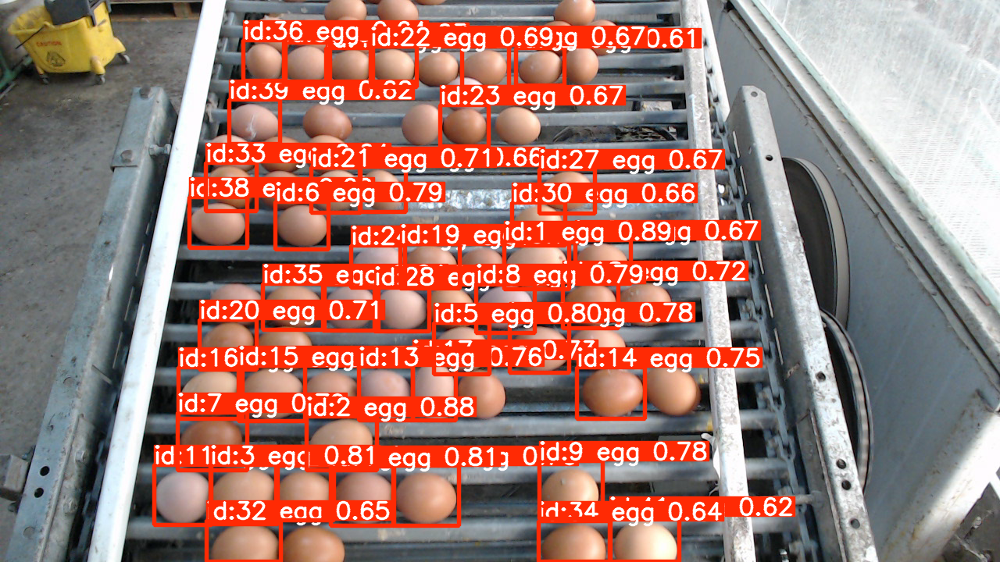

# Egg Detection Project Documentation

## Overview

This project leverages the power of NVIDIA® Jetson™ Orin™ NX 16GB and a custom YOLOv8 model to detect eggs in real-time using an HD Pro Webcam C920. The project is designed to run on the latest JetPack 6 OS, which comes pre-installed with Python 3.10, CUDA 12, TensorRT, Tegra, and OpenCV.

The program uses the `ultralytics` YOLOv8 model, optimized for egg detection, and integrates with the Jetson's capabilities to process video streams from a connected camera.

## Hardware and Software Tested On

### Hardware
- **Jetson Orin NX 16GB**
- **HD Pro Webcam C920**

### Software
- **JetPack 6 OS**
- **Python 3.10**
- **CUDA 12.2**

## Setup Instructions

### 1. Initial Setup on Jetson Orin NX

Start by updating your system and installing the required Python packages:

```bash
sudo apt update
sudo apt install python3-pip
python3 -m pip install --upgrade pip
```

### 2. Install Jetson-Specific Packages

To monitor your Jetson Orin NX performance, install `jetson-stats`:

```bash
pip install jetson-stats
```

This will allow you to use `jtop` to monitor system resources.

### 3. Install YOLOv8 and Dependencies

Install the `ultralytics` package, which provides the necessary tools for YOLOv8:

```bash
pip install ultralytics
```

### 4. Install PyTorch, TorchAudio, and TorchVision

To optimize the YOLOv8 model on Jetson Orin NX, you'll need to install the custom-built PyTorch, TorchAudio, and TorchVision packages. Use the following commands:

```bash
pip install http://jetson.webredirect.org/jp6/cu122/+f/58f/a1599f99fc2fb/torch-2.3.0-cp310-cp310-linux_aarch64.whl#sha256=58fa1599f99fc2fb7429a25d774c848931412448bc591425c5b60c7a74376c18
pip install http://jetson.webredirect.org/jp6/cu122/+f/9e9/6fd74399b06ec/torchaudio-2.3.0+952ea74-cp310-cp310-linux_aarch64.whl#sha256=9e96fd74399b06ec97a09416892658c10884447f0564373d3518ebdead3ffdee
pip install http://jetson.webredirect.org/jp6/cu122/+f/28a/62174f5604aa1/torchvision-0.18.0a0+6043bc2-cp310-cp310-linux_aarch64.whl#sha256=28a62174f5604aa111f06c7d61f488250a3c8940fce05bbf245500b90b1d1486
```

### 5. Install Jetson Utilities

To handle video streams and other utilities on the Jetson platform, install the `jetson-utils` and `jetson-inference` libraries:

```bash
git clone https://github.com/dusty-nv/jetson-utils.git
git clone https://github.com/dusty-nv/jetson-inference.git
```

Navigate to the `jetson-inference` directory and run the pre-build script:

```bash
cd jetson-inference
chmod +x CMakePreBuild.sh
./CMakePreBuild.sh
```

Next, compile and install the `jetson-utils`:

```bash
cd ../jetson-utils
mkdir build
cd build
cmake ../
make -j$(nproc)
sudo make install
sudo ldconfig
```

## Running the Egg Detection Program

Once the setup is complete, you can run the egg detection program using the custom YOLOv8 model. Make sure the HD Pro Webcam C920 is connected to your Jetson Orin NX, and run your detection script as follows:

```bash
python3 egg_detection_jetson_capture.py
```

## Monitoring System Performance

To monitor the performance of your Jetson Orin NX while the egg detection program is running, use `jtop`:

```bash
jtop
```

This tool will provide real-time insights into CPU, GPU, memory usage, and more.

## Conclusion

This documentation provides all the necessary steps to set up the Jetson Orin NX for the egg detection project. With the custom YOLOv8 model and the powerful hardware of the Jetson platform, you can achieve high-performance real-time object detection.